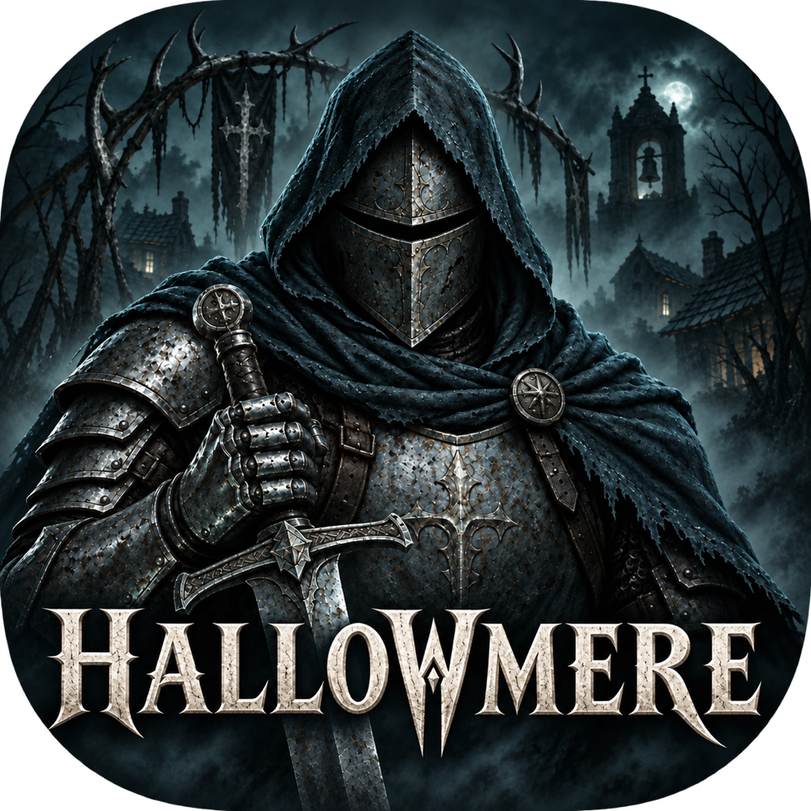
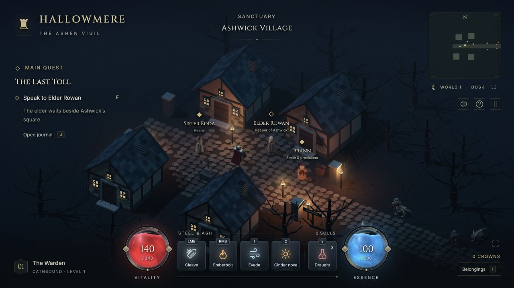

<div align="center">

  <h1>Hallowmere — The Ashen Vigil</h1>

  

  <p>A complete original dark fantasy action RPG built with Three.js. Travel between two villages, speak to four characters, fight randomized wilderness packs, collect and equip loot, and silence the Bellkeeper in the haunted village of Hallowmere.</p>

  

  <p><em>Captured from the running game in Ashwick Village.</em></p>

</div>

## Run

Requires Node.js 20 or newer. No installation or build service is needed: the pinned Three.js 0.180.0 runtime is included locally.

```sh
npm run dev
```

Open **http://127.0.0.1:5182**. To play from another device on the same network, run `npm run dev:network` and open the printed Network URL. The static game is in `dist/` and can be served by any static web server. A WebGL2-capable browser is required. Sound begins after the first interaction.

## GitHub Pages

The [Pages workflow](.github/workflows/pages.yml) tests and validates the game on pull requests to `main`. Pushes to `main` also deploy the checked-in `dist/` directory. You can redeploy from **Actions → Deploy game to GitHub Pages → Run workflow** on `main`.

For the first deployment, select **GitHub Actions** under **Settings → Pages → Build and deployment → Source**, then push `main`. The game will be available at **https://miguelsolorio.github.io/hallowmere/** after the workflow succeeds. No repository secrets or package installation are required; deployment uses the workflow's built-in GitHub token.

Keep local asset URLs relative so the game works both at a domain root and under a repository path such as `/hallowmere/`. `npm run build` checks these URLs before deployment. The workflow uses GitHub's [custom Pages deployment actions](https://docs.github.com/en/pages/getting-started-with-github-pages/using-custom-workflows-with-github-pages).

## Controls

| Action | Control |
| --- | --- |
| Move | WASD / arrow keys / click ground |
| Target and cleave | Click a creature; hold to chase and attack |
| Stand and cleave | Shift + left click |
| Emberbolt | Right click |
| Evade | 1 |
| Cinder nova | 2 |
| Healing draught | 3 |
| Speak to a villager / collect nearby loot | F or click its label |
| Equipment inventory | I |
| Reveal loot labels during combat | Hold Alt |
| Journal / map / pause | J / M / Escape |

Touch devices have a movement stick and ability buttons with automatic enemy aiming. Red ground indicators show enemy attacks before they resolve. Evade grants brief invulnerability. Essence regenerates. Every defeated monster drops crowns; draughts and equipment can also drop. Walk over crowns, or use F/click a label to collect loot. Equip weapons and charms in the inventory for real damage and vitality bonuses. Brief browser focus changes do not open a pause menu. Switching away from the game suspends it silently, and returning resumes it automatically; a manually opened pause menu, map, or conversation stays open. Interrupted touch gestures reset the movement stick.

## Buildings

All twelve buildings have walkable rooms. Approach a front door with the movement stick or WASD, tap the door, or use the nearby Enter button. Roofs lift away inside; Leave guides you back through the doorway. Side and rear walls remain solid, including on rotated houses and during an evade. Hallowmere Chapel unlocks when the Bellkeeper is defeated.

## Campaign

Start in the safe village of **Ashwick**. Elder Rowan offers *The Last Toll*. Sister Edda restores vitality, essence, and a minimum of three draughts for free. Brann sells draughts and hones any equipped blade for crowns.

Follow the cobbled **Mourning Road** east through three randomized packs (six to nine monsters). A new run creates a fresh seed, which changes the creatures, positions, and loot. Watchman Rook waits in a protected lantern ward at Hallowmere’s gate and shares supplies once.

Defeat the twelve afflicted in **Hallowmere** to summon **the Bellkeeper**, a 720-vitality boss with telegraphed ground attacks and radial projectiles. Road kills do not count toward the village objective. The boss always drops 60 crowns, two draughts, and **Bellkeeper’s Requiem**, a legendary blade with +18 cleave damage. Collect the relic, equip it, and return to Rowan for an 80-crown quest reward. Exploration and trading continue after victory.

Each vigil is a single-session adventure. “Begin a new vigil” resets progress and rerolls the road.

## Generated assets

Eight original articulated GLB models are generated by `scripts/generate-assets.mjs`: Warden, Hollow, Grave Hound, Cinder Revenant, Bellkeeper, Elder, Healer, and Smith. The audio workshop produces 79 layered PCM WAV assets from 40 CC0 Kenney recordings and original synthesis. It covers combat, distinct creature voices, three footstep surfaces, doors, inventory, healing, bells, and evolving stereo ambience. Regenerate everything with `npm run generate`, or only sound with `npm run generate:audio`; the audio sources are checked in and regeneration requires only Node.js.

The [audio research and self-review](docs/audio-direction.md) explain the selected sources, sound palette, mix decisions, and verification. A [34-second preview](docs/audio-preview.wav) was rendered through the actual Web Audio mixer. Combat cues load first, followed by other effects and ambience; the full PCM bank is 23.8 MiB. Sound is positioned relative to the player, muffled through walls, and ducked beneath important attack cues. Ambience crossfades between regions, grows tense near enemies, and quiets after victory. Background tabs fade to silence and suspend audio.

The two villages and connecting forest use merged scenery geometry, instanced cobbles and grass, shadowed moonlight, animated torchlight, drifting ash, and a shader portal. Creature parts are merged by material while retaining animated limb groups.

The [1024 × 1024 app icon](dist/assets/icons/app-icon.png) was created with built-in ImageGen using the Warden artwork and village screenshot as references, then revised to match the game's cold blue-green shadows, weathered steel, and haunted atmosphere. It includes the Hallowmere title and rounded corners. Browser and home-screen exports live in `dist/assets/icons/`; the game uses them as its favicon and Apple touch icon. The [artwork notes](docs/app-icon.md) include the revision prompt. The gameplay screenshot above is a direct browser capture.

## Validation

```sh
npm test
npm run build
```

The checks cover combat geometry, cooldown and resource rules, health and death, collision and pathfinding, progression, seeded encounters and safe zones, loot collection and equipment, NPC services and quest rewards, GLB structure and numeric buffers, audio integrity, seamless loops, variation, spatial mixing, voice budgets, mute/pause behavior, failed-download recovery, script syntax, and asset/DOM references.

Optional browser WebMCP integration exposes `get_vigil_state` and `control_warden` through the same game rules and controls. Browsers without it run the game normally.

## Attribution

Game code, environment, and creature meshes are original. Audio combines original sound design with CC0 recordings from [Kenney Impact Sounds](https://kenney.nl/assets/impact-sounds) and [Kenney RPG Audio](https://kenney.nl/assets/rpg-audio). Publisher license text and a file-by-file source manifest are in `scripts/audio-sources/`; runtime credits are in `dist/assets/audio/CREDITS.txt`. [Three.js](https://threejs.org/) is MIT licensed; its license is included at `dist/vendor/LICENSE.three`. Fonts are Cinzel and Inter from Google Fonts. The GLB loading setup follows the [official Three.js GLTFLoader documentation](https://threejs.org/docs/pages/GLTFLoader.html).
