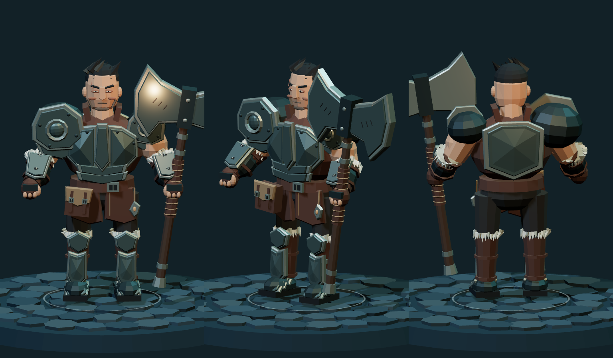

# Chosen character concepts

Selections submitted by the user on September 12, 2026. The source of these
choices is the Hallowmere character study gallery.

## Wizard directions

| ID | Direction | Weapon | Off-hand focus |
| --- | --- | --- | --- |
| W06 | Mire Witch | Gnarled root staff | Marsh lantern |
| W07 | Bone Oracle | Skull-topped staff | Spirit skull |
| W10 | Storm Hermit | Lightning fork staff | Storm orb |

## Character classes

| ID | Class | Weapon | Off-hand equipment |
| --- | --- | --- | --- |
| C01 | Sorcerer | Crystal-tipped staff | Spellbook |
| C02 | Ranger | Elven longbow | Quiver & twin fighting knives |
| C03 | Reaver | Two-handed war axe | Fury talisman |
| C04 | Nightblade | Paired elven blades | Throwing knives |
| C05 | Oathkeeper | Caduceus staff | Radiant wings & Caduceus blaster |
| C09 | Plague Alchemist | Hand crossbow | Alchemical flask |

## Study organization

The gallery opens on these nine concepts, with the six classes together and the
three wizard directions in a separate Sorcerer appearance group. Treating the
wizard directions as Sorcerer appearances is the current working interpretation;
the original selection included all three without choosing a default. Bone Oracle
is now the gameplay default, while this gallery preserves the original studies.
The Sorcerer's original C01 study remains available as its class reference.

The recorded choices live in `dist/character-study-selection.js`. The editable
browser shortlist begins with these choices and can change independently.
All 20 original concepts remain available in the other gallery collections.

## Playable roster

Seven characters are integrated into the live game, including Geralt using the
existing character study model. The initial character screen shows their weapons,
equipment, stats, and abilities. Sorcerer defaults to **Bone Oracle (W07)**, with
the skull-topped staff and spirit skull. Skin selection is removed, and saved
picker preferences use Bone Oracle on the next selection. Older active sessions
can retain their Sorcerer appearance; the original studies remain archived.
All Sorcerer appearances share the same combat kit. Fireball restores the
large fireball, fiery trail, cast flash, and impact burst on right mouse
(18 essence, 1.2-second cooldown), replacing Frostbind.

The live picker uses **Circle of Oaths** (selection study 03): seven portrait
medallions surround the selected character. The arrows halfway up either side
of the character cycle through the roster and wrap at both ends. Selecting a
portrait also changes the active calling. With focus in the wheel, arrow keys
cycle, and Home/End select the first/last character. The active portrait remains
the wheel's single tab stop; the previous/next buttons are separately focusable.
Starting stats remain visible; expand an ability or Equipment for its details.
Selection controls lock while a class change is being confirmed by the game.

| Class | Primary attack | Right mouse | 1 · Evade | 2 · Class skill |
| --- | --- | --- | --- | --- |
| Sorcerer | Arcane Bolt | Fireball | Miststep | Elemental Storm |
| Ranger | Elven Quickshot / Twin Blades | Piercing Shot | Elven Step | Threefold Volley |
| Reaver | Rend | War Cry | Rush | Blood Whirl |
| Nightblade | Twin Cut | Knife Fan | Shadowstep | Smoke Veil |
| Oathkeeper | Caduceus Blaster | Caduceus Staff | Guardian Angel | Valkyrie |
| Plague Alchemist | Virulent Bolt | Bitter Remedy | Quickstep | Miasma |
| Geralt | Steel Strike | Igni | Witcher’s Roll | Quen |

Press **C**, click the character name, or choose **Change character** from the game
menu while in a sanctuary. Switching retains quest progress, crowns, equipment
IDs, upgrades, and health/essence percentages. Weapons adapt to the chosen class;
cooldowns cannot be reset by switching. A per-tab reconnect retains the class,
and group world resets retain the class choice while resetting campaign progress.

The Ranger's Legolas-inspired kit keeps the existing `ranger` class and `C02`
appearance identity. Primary attacks automatically use two knife cuts against
visible enemies within 2.15 units in the forward cone, and bow shots otherwise.
Both modes share one cooldown. Elven Step follows movement input or retreats
opposite the aim when stationary. Threefold Volley fires three physical arrows;
each can pierce two enemies and is stopped by walls.

The reference-based Ranger mesh is shared by selection, inventory, the character
study, and gameplay. Swept-back blond hair and side braids leave the pointed ears
visible above a fitted olive tunic, engraved leather bracers, and a grey cloak
with a silver leaf clasp. The carved longbow, full quiver, and ivory-handled twin
knives remain attached to the animated body. During a close-range primary attack,
the bow moves to the back and both knives appear in the hands; the bow returns
when the two cuts finish. Ranged attacks use a dedicated bow-draw pose.

The authoritative server owns damage, projectiles, poison and bleed ticks,
roots, slows, shields, concealment, and cooperative healing. Class definitions
and live ability descriptions are in `dist/classes.js`; the gallery remains a
separate archive of the original concepts and their proposed skills.

## Reaver tank redesign

Reaver (C03) now wears a broad, layered steel cuirass, an oversized left
pauldron, fur-lined bracers and greaves, and articulated armored boots. Short
dark hair, an angular face, exposed upper arms, a leather satchel, and a fury
talisman follow the supplied armored-warrior reference in the roster’s native
faceted 3D style. The forged two-handed axe keeps the existing combat identity.
The shared model appears in the study gallery, class picker, inventory, and
live local and multiplayer actors.

The tank tuning raises base vitality from 180 to 220 and War Cry’s four-second
damage reduction from 35% to 45%, while lowering movement speed from 4.6 to
4.3. Rend, Rush, and Blood Whirl retain their existing behavior.

## Oathkeeper angelic support redesign

Oathkeeper keeps the `oathkeeper` / `C05` identity with Mercy-inspired ivory and
gold armor, blonde hair tied in a high ponytail, a halo, a Caduceus staff, a sidearm,
and articulated wings with luminous feathers. The shared native 3D model appears
in gameplay, the class picker, inventory portraits, and the study gallery. Wings
unfurl during Guardian Angel and Valkyrie; the sidearm appears during primary fire.

- **Primary / Caduceus Blaster:** a golden ranged projectile for solo combat.
- **Right mouse / Caduceus Staff:** a three-second tether to the reachable ally
  closest to the cursor, or the most injured nearby ally with keyboard/touch.
  It heals 14 vitality every half-second; a healthy ally instead receives a
  refreshed 30% damage boost. Healing an ally also restores 25% of that healing
  to Oathkeeper. With no reachable ally, it heals Oathkeeper. Moving out of range,
  crossing a wall, dying, disconnecting, or changing maps breaks the tether.
- **1 / Guardian Angel:** fly toward the ally closest to the cursor, stopping
  beside them. Without a reachable ally, use the normal directional evade.
- **2 / Valkyrie:** six seconds of extended wings, 25% faster movement, and a
  moving aura that heals and boosts nearby allies (including Oathkeeper). On
  activation, resurrect the nearest reachable fallen teammate within six units
  at half health, in place, with a second of invulnerability. Resurrection is
  combined with Valkyrie to fit the existing four combat controls. It neither
  resets possessions/cooldowns nor revives across walls or maps.

Base vitality is 135, essence 110, and movement speed 5. Staff healing and Valkyrie
work in solo play. Tethers appear gold while healing and blue while amplifying
an ally; their endpoints follow the actual staff and teammate on each client.
The authority owns targeting, healing, boosts, resurrection, and flight movement.
